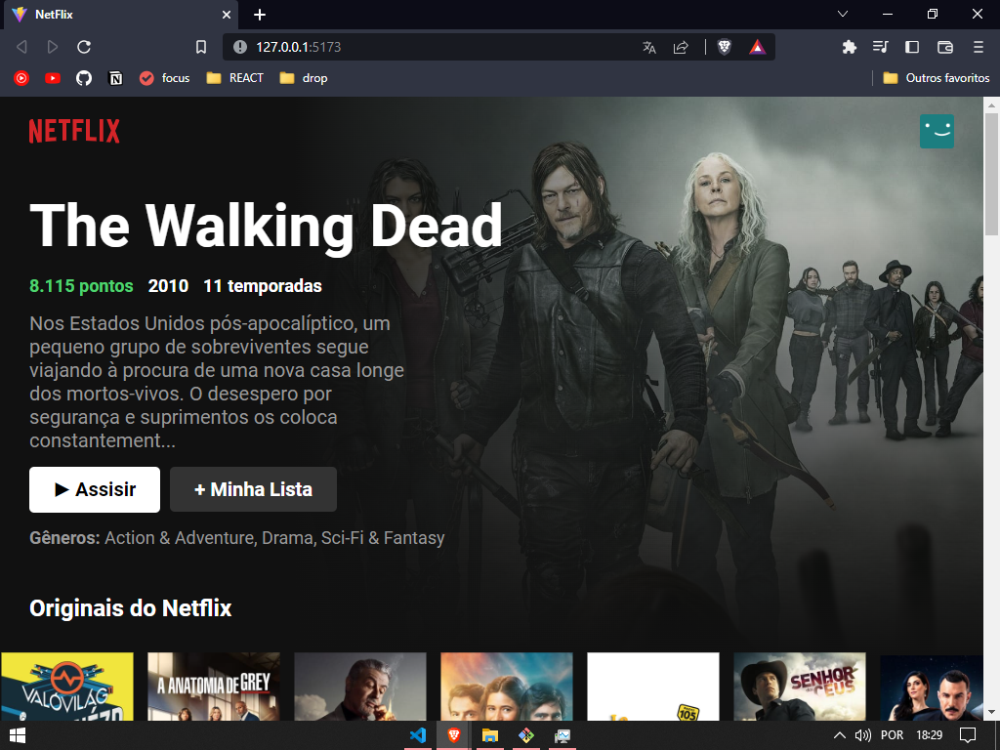
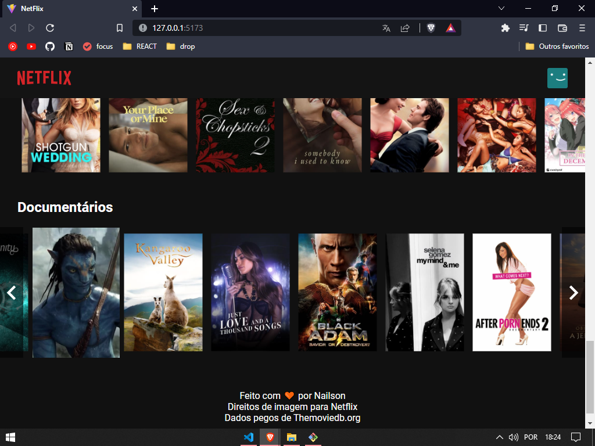

# 🎬 Clone da Netflix

Projeto desenvolvido com o objetivo de replicar a página inicial da **Netflix**, buscando ser o mais fiel possível em termos de layout e funcionalidades visuais.

## 🚀 Tecnologias utilizadas

- [Vite](https://vitejs.dev/) — Build tool ultra rápida
- [ReactJS](https://pt-br.reactjs.org/) — Biblioteca para interfaces web
- [Fetch API](https://developer.mozilla.org/pt-BR/docs/Web/API/Fetch_API) — Requisições HTTP nativas
- [The Movie Database API (TMDB)](https://www.themoviedb.org/) — Fonte dos dados dos filmes e séries

## 💻 Demonstração

### 🏠 Página inicial  


### 🧭 Exemplo de navegação  


### 📜 Rodapé  


## 🛠️ Funcionalidades

- Listagem dinâmica dos filmes e séries populares.
- Carrossel horizontal navegável.
- Informações consumidas diretamente da API TMDB.
- Layout responsivo inspirado na Netflix.

## 🔥 Como rodar localmente

```bash
# Clone o repositório
git clone https://github.com/nailsonlima/netflix-react-clone

# Acesse a pasta
cd netflix-react-clone

# Instale as dependências
npm install

# Rode o projeto
npm run dev
A aplicação irá abrir em http://localhost:5173/ no seu navegador.
````
🤝 Contribuição:  
Sinta-se à vontade para utilizar, melhorar e contribuir com este projeto. Toda sugestão é bem-vinda! 🚀

👨‍💻 Autor:  
Feito com dedicação por:
Nailson Lima 🚀

🎯 Agradecimento:  
Obrigado por acessar este projeto! 💜
